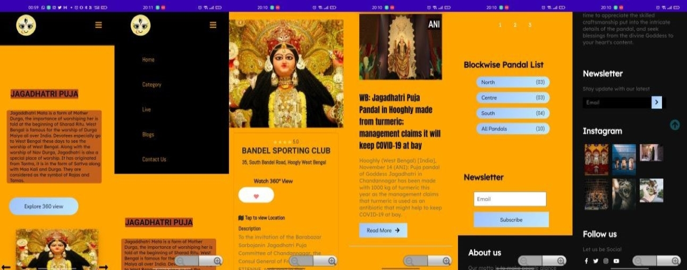

# 360 Pandal Viewer App

The 360 Pandal Viewer App was specially crafted to commemorate the joyous occasion of Jagdharti Puja. Developed using Android Studio, this innovative app offers an immersive and captivating experience for users to virtually explore the intricately designed pandals of Hoogly District.

## Features

- Virtual tours of pandals using cutting-edge 360-degree cameras (Insta360 X2).
- Integration with the powerful Kuula platform for a seamless viewing experience.
- GPS technology for effortless location of desired pandals.
- Rating and comment section for community engagement and feedback.

## How to Use

1. Download or Clone the file
2. Use Android Studio to build the app.
3. Install the app on your Android device.
4. Open the app and explore the beautifully decorated pandals in 360 degrees.
5. Use the GPS feature to locate and navigate to specific pandals.
6. Share your experience by rating and leaving comments.

## Tech Stack

- Android Studio
- 360-degree cameras (Insta360 X2)
- Kuula platform

## Contributions

Contributions to the 360 Pandal Viewer App are welcome! Feel free to submit bug reports, feature requests, or pull requests to help improve the app and enhance the user experience.

## Screenshots

## Contact

For any inquiries or questions, please contact [saqlainrashed2001@gmail.com](mailto:your-email-address). We would love to hear your feedback and suggestions!
